# Cognitive Model Evaluation

Cognitive models are branching out across numerous fields, and to evaluate these models is always a little challenge when you have multiple models in front of you to choose from. This code pattern details about the Watson Model Evaluation Workbench which provides user a platform to configure, execute and test user's cognitive model for tools supported Watson cognitive services, prepare performance evaluation data and calculate performance statistics such as confusion matrix and ROC curve.

By the end of this code pattern reading, one will be able to:
- To compare different Watson cognitive service models and selecting the threshold and best-performing machine learning model.
- Configure Watson cognitive service access details in workbench and input model test data to workbench for service performance evaluation.

Workbench executes supported Watson cognitive services with their input model’s test data, prepare performance evaluation data, calculates performance statistics and present user with the following recommendations, curve and summary statistics:

## Architecture
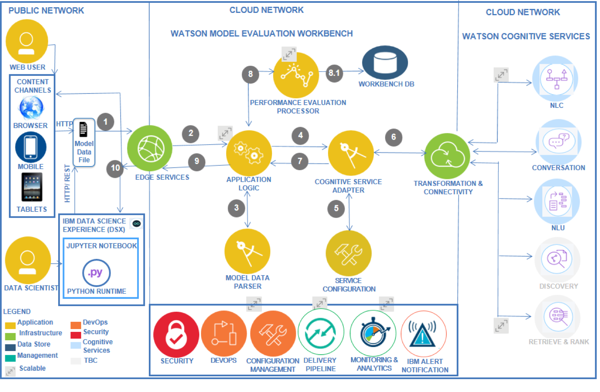

1. User uses the client device(mobile, tablets, etc.,) to access the application.
2. Client Invokes the URL.
3. Parse Input test data.
4. Invoke adapter which calls the Cognitive service models(Natural Language Classifier, Natural Language Understanding, etc.,)
5. Parse the Cognitive model service configuration.
6. Connect to Cognitive model services.
7. Gets response from Cognitive services.
8. Compares the expected result with cognitive model results and do performance evaluation.
9. Performance analysis is shown on UI
10. User consumes the performance analysis results.

## Included Components
* [Java Liberty Run Time](https://console.bluemix.net/docs/runtimes/liberty/index.html#liberty_runtime) - Develop, deploy, and scale Java web apps with ease. IBM WebSphere Liberty Profile is a highly composable, ultra-fast, ultra-light profile of IBM WebSphere Application Server designed for the cloud.
* [Natural Language Classifier](https://console.bluemix.net/catalog/services/natural-language-classifier) - The Natural Language Classifier service applies cognitive computing techniques to return the best matching classes for a sentence or phrase.
* [Natural Language Understanding](https://console.bluemix.net/catalog/services/natural-language-understanding)- Analyze text to extract meta-data from content such as concepts, entities, keywords, categories, sentiment, emotion, relations, semantic roles.
* [Watson Assistant](https://console.bluemix.net/catalog/services/watson-assistant-formerly-conversation) - Adds natural language interface to your application to automate interactions with your end users. Common applications include virtual agents and chat bots that can integrate and communicate on any channel or device. 


## Featured Technologies

* [Liberty for Java](https://console.bluemix.net/docs/runtimes/liberty/index.html#liberty_runtime): Develop, deploy, and scale Java web apps with ease. IBM WebSphere Liberty Profile is a highly composable, ultra-fast, ultra-light profile of IBM WebSphere Application Server designed for the cloud.
* [Aritificial Intilligence](https://www.computerworld.com/article/2906336/emerging-technology/what-is-artificial-intelligence.html): Intelligence demonstrated by machines, in contrast to the natural intelligence displayed by humans.

## Watch The Video
Will be added soon...


## Steps
Follow these steps to setup and run this code pattern. The steps are described in detail below.
1. [Pre-requisites](#1-pre-requisites)
2. [Create the Cognitive models](#2-create-the-cognitive-models)
3. [Deploy the application to the IBM Cloud](#3-deploy-the-application-to-the-ibm-cloud)
4. [Deploy the application to local machine](#4-deploy-the-application-to-local-machine)
5. [Run the application](#5-run-the-application)
6. [Analyze the Results](#6-analyze-the-results)


## 1. Pre-requisites
- IBM Cloud account: If you do not have an IBM Cloud account, you can create an account [here](https://console.bluemix.net/).
- If you opt to deploy the Liberty application manually then
  Cloud Foundry cli should be installed. If not installed, click [here](https://docs.cloudfoundry.org/cf-cli/install-go-cli.html) for instructions to install.
- Maven should be installed. If not installed, you can download Maven from [here](https://maven.apache.org/download.cgi). You
      can refer to installation instructions [here](https://maven.apache.org/install.html).
- Install [Eclipse tool](https://www.eclipse.org/downloads/)


## 2. Create the Cognitive models
 
While we can use any watson models, for the sake of this code pattern we will use Natural Language Classifier(NLC).

Create the Natural Language Classifier models by following the below steps:

### Create NLC service instance
- Click [here](https://console.bluemix.net/catalog/services/natural-language-classifier) to create NLC service
- Below screen is displayed
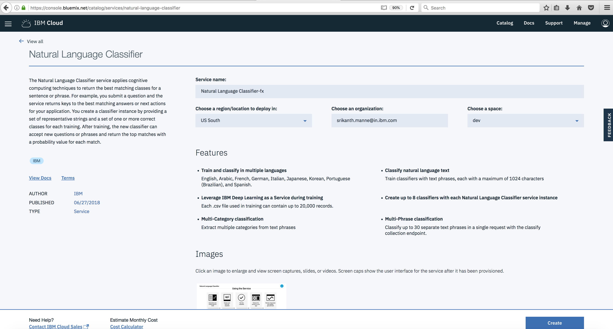
- Edit the field "Service name:" to say NLC_Model_Eval and leave the other settings default.
- Click `Create` and NLC service instance gets created and then take a note of the credentials as below:
  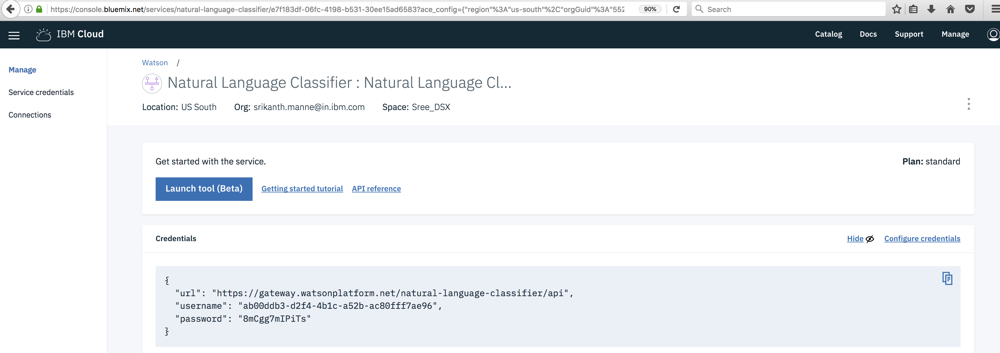

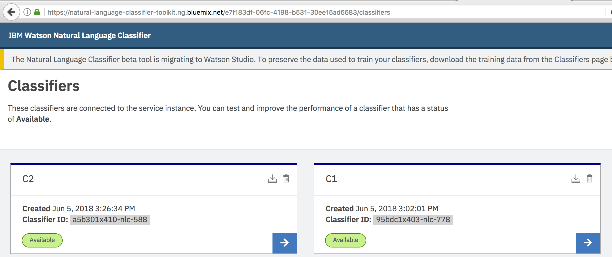
-   Create another Classifier as below screenshot.
-   Upload the available training data if already exists in csv format.


## 3. Deploy the application to the IBM Cloud
  
The application can be deployed on IBM Cloud or locally.
Exceute Step 3 for deploying on IBM Cloud or Step 4 to deploy locally.
 
### 3.1 Deploy to the IBM Cloud
- Clone the repository from the GitHub(Link-----).

- From the terminal, navigate to the cloned repository folder and then exceute the below commands:
- Execute full Maven build to create the `target/workbenchModelEval.war` file:
    ```bash
    $ mvn clean install
    ```
    After the successfull execution of the above command, the war file gets generated under the target folder.
    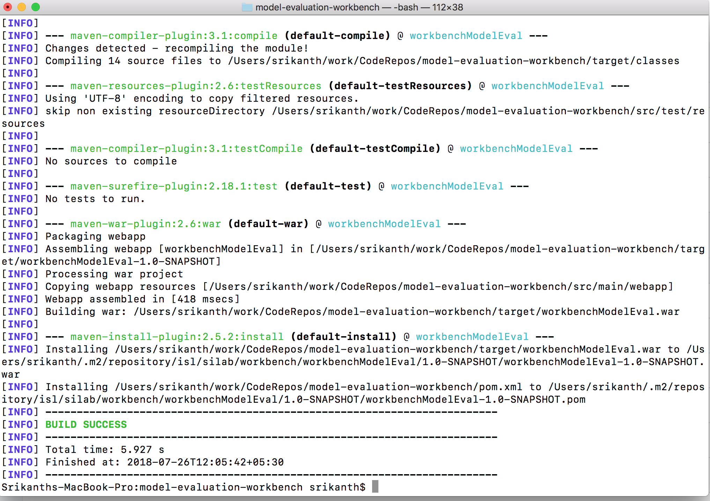
    
  Open the manifest.yml file and update name and host to be unique applicatipn name.  
  
  
-  Push the application to the cloud account using the below command:
    ```bash
    $ bx cf push <Application_Name>
    ```
-  See below screen shot for the successful deployment of the app to the cloud
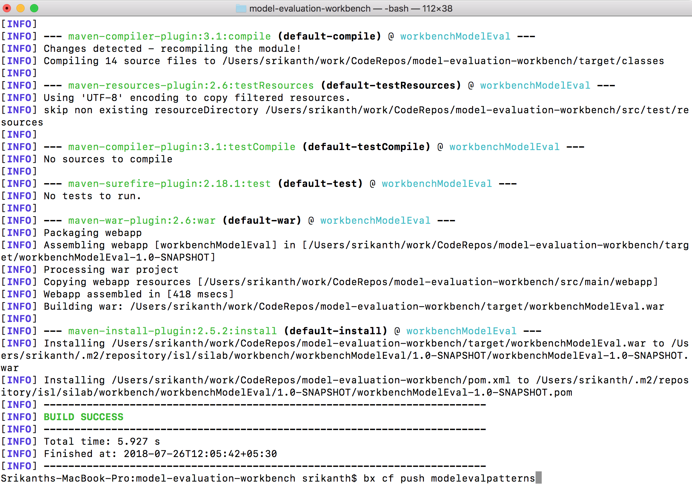

- Open IBM Cloud Console, Under Dashboard you shouls see the above deployed application running. Click on the application.
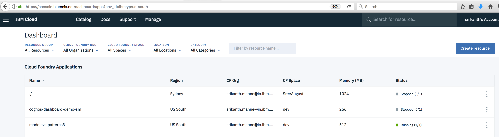
- Click on Visist app URL link to launch the application.
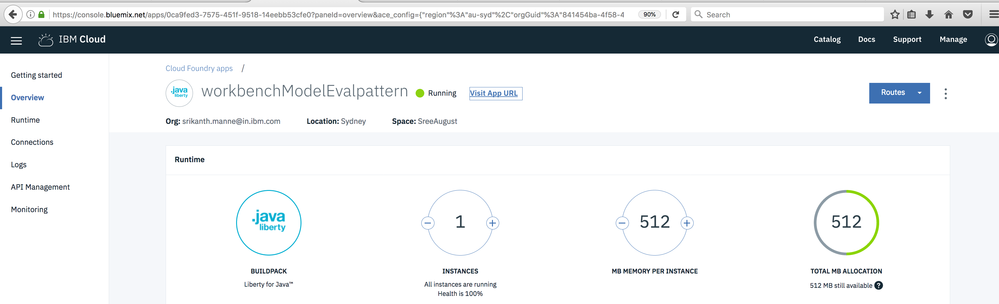

### 3.2 Configure the app with the cognitive models

Go to IBM Cloud Clonsole, click on application that was deployed, click on Runtime and then click on Environment variables. 
Under User defined section Click on Add, then under `Name` enter the text as `NLC_USERNAME_CONFIG_1` and under value pass the username of the first NLC service instance that was created in section `Create NLC service instance`. 
Repeat the same for adding `NLC_PASSWORD_CONFIG_1 = <password>`, `NLC_CLASSIFIER_ID_CONFIG_1`
And Add the second set of model details  `NLC_USERNAME_CONFIG_1`, `NLC_PASSWORD_CONFIG_1 = <password>` and `NLC_CLASSIFIER_ID_CONFIG_1` similarly.

- Watson Service Configuration
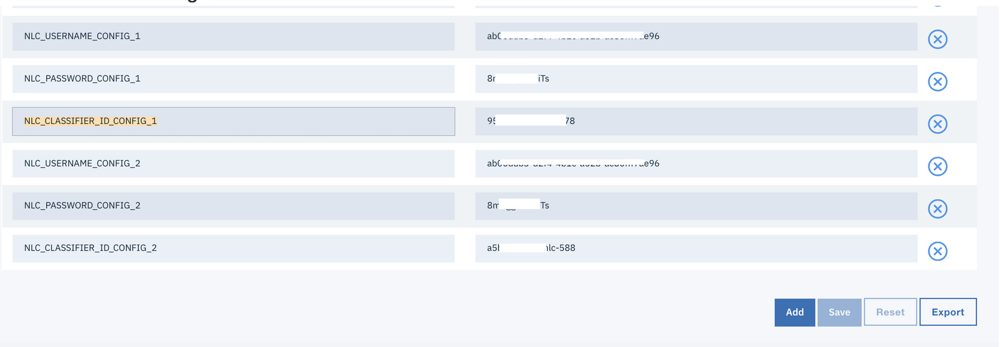

Skip Step 4 and Go to Step 5 to Run Application.


## 4. Deploy the application to local machine
   
The application can be deployed on IBM Cloud or locally. Exceute Step 3 for deploying on IBM Cloud or Step 4 to deploy locally.

### 4.1 Clone git repository
* open command prompt. Change directory to location where you want to download project files. Go to that directory.
* run `git clone git@github.com:IBM/model-evaluation-workbench.git` to clone the repository
   
### 4.2 Deploy to local machine 
- Launch Eclipse
- In the menu, goto file->Import
- Under Import wizard, expand General folder and select `Existing Project into Workspace`. 
- Click Next and browse to the cloned project folder.
- Click the Finish button.
- Setup Liberty server in eclipse as per this [Link](https://www.ibm.com/blogs/bluemix/2016/05/liberty-and-eclipse-create-server-p10/)

- Application needs to access models to send requests to and get responses from them. Access details of these models have to be provided in server config (server.env) file of liberty server. A sample server.env file snapshot is as in below image. You will need to provide the credentials of the models. You can access NLC credentials as described in section `Create NLC service instance`
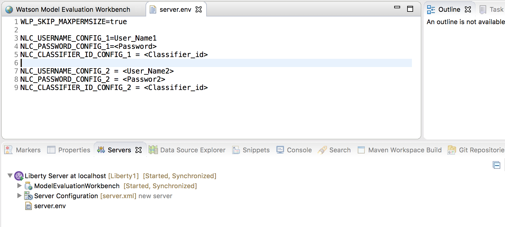

- Start the Liberty Server

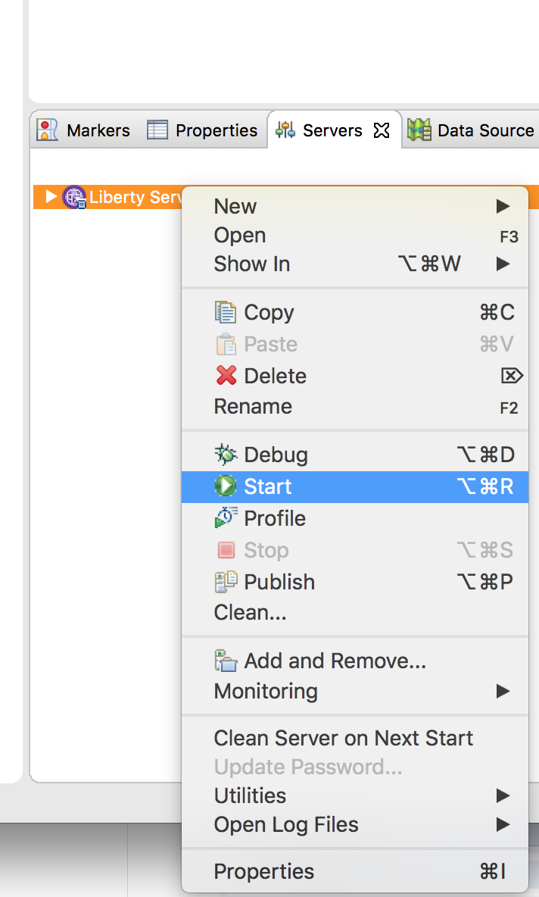

- Right Click on the Liberty Server created above, Click on the `Add and Remove`
- Under Add and Remove wizard, from the available section move `ModelEvaluationWorkbench` to configured section.
- Click on Finish.
- Model Evaluation application started.
- Under the Console tab, you will see default_host link similar to http://localhost:9091/ModelEvaluationWorkbench/. Click on that link to launch the application.

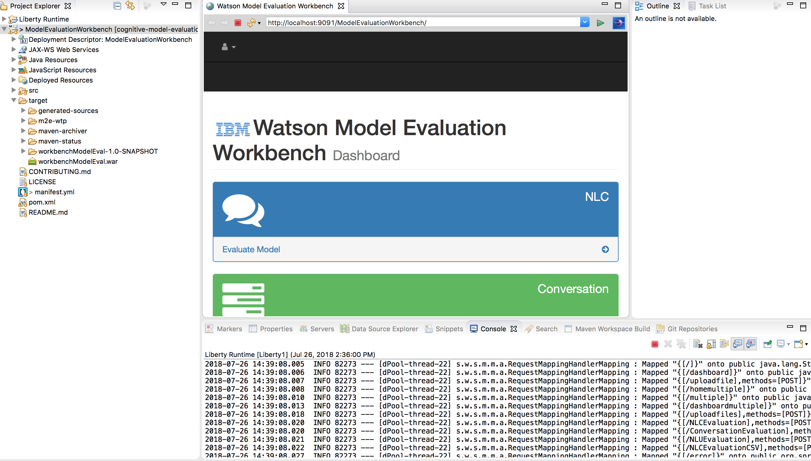

### 4.3 Configure the app with the available cognitive models

- Add config parameters to the server.env file within eclipse. Add 2 set of Credentails related to the Cognitive services which you want to evaluate.


_ Launch the application using the localhost URL:
http://localhost:9091/ModelEvaluationWorkbench/
- Start the server(Right click on the newly added server)
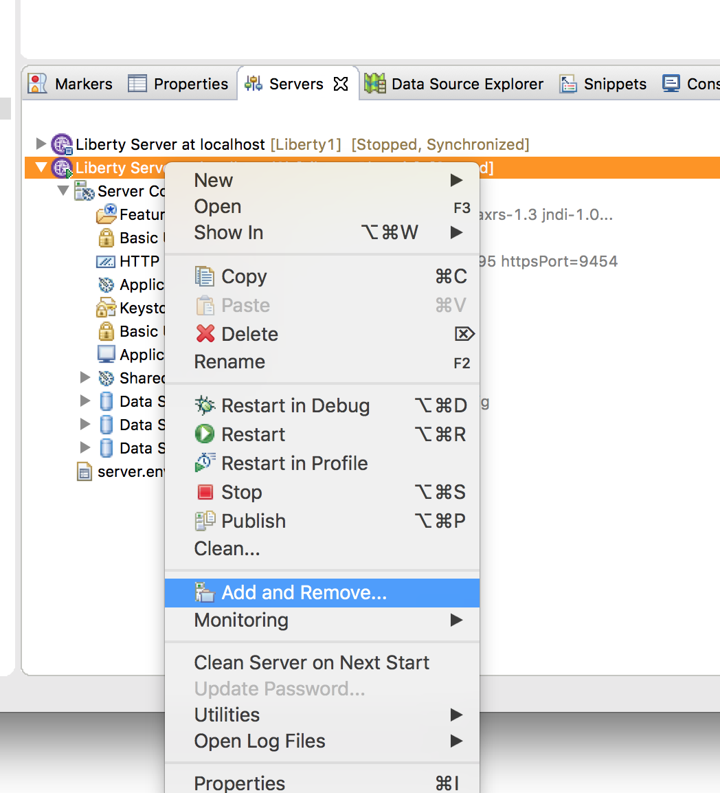
- Launch the application.
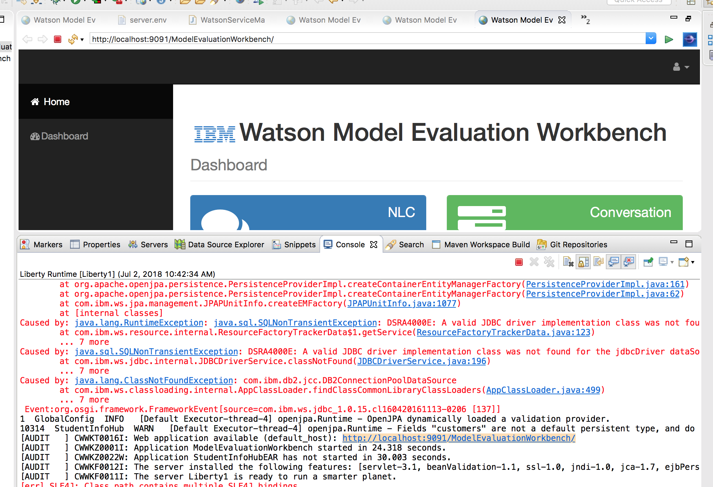


zzzzzzz


## 4. Run the Application 

#### Scenario:
We created 2 models using Natural Language Classifier.

Now, we would evaluate which model is performing better when compared to each other. For that we would have already configured as per application deployment steps.

Below are the steps to Evaluate the performance:
-	Step1: Ensure the configuration of the credentials in the Runtime Environment variables are set appropriately. See below screen grab.
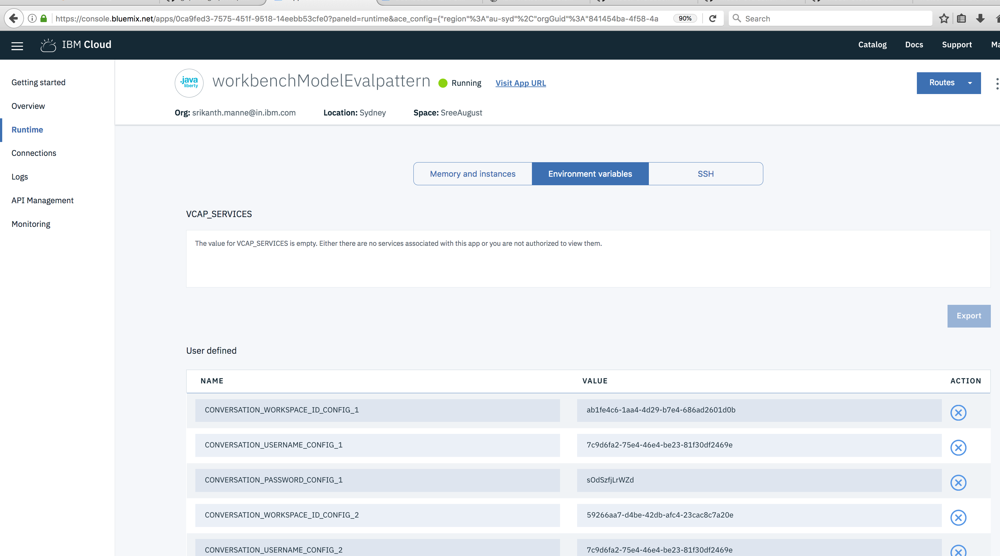

-	Step2: Launch the app URL
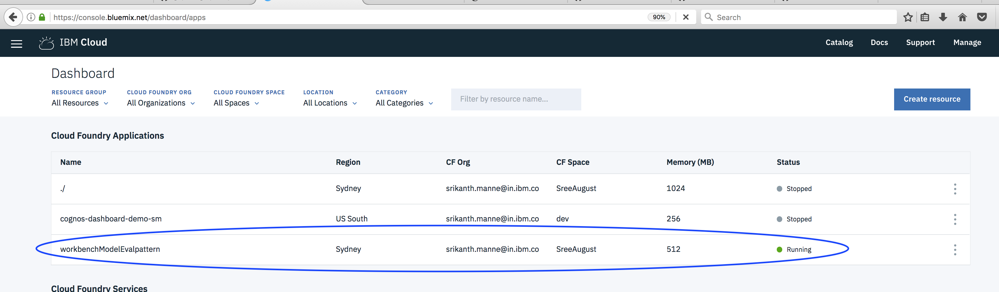


-	Step3: Click on NLC Evaluate model and select the classes from the drop-down bar.
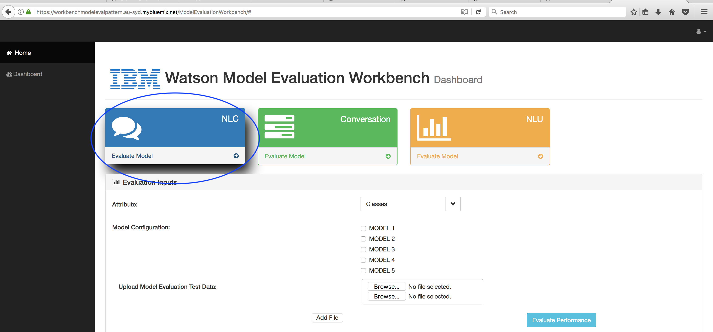

-	Step4: In the model1 and model2 browse for the Truth file (the actual results that you have). This is the file which has the correct sample set of data.
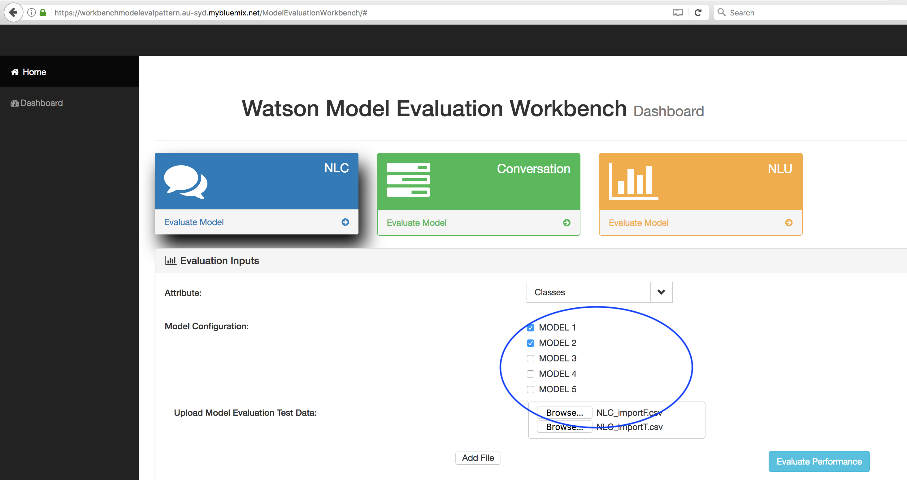

-	Step5: Click on Evaluate Performance button.
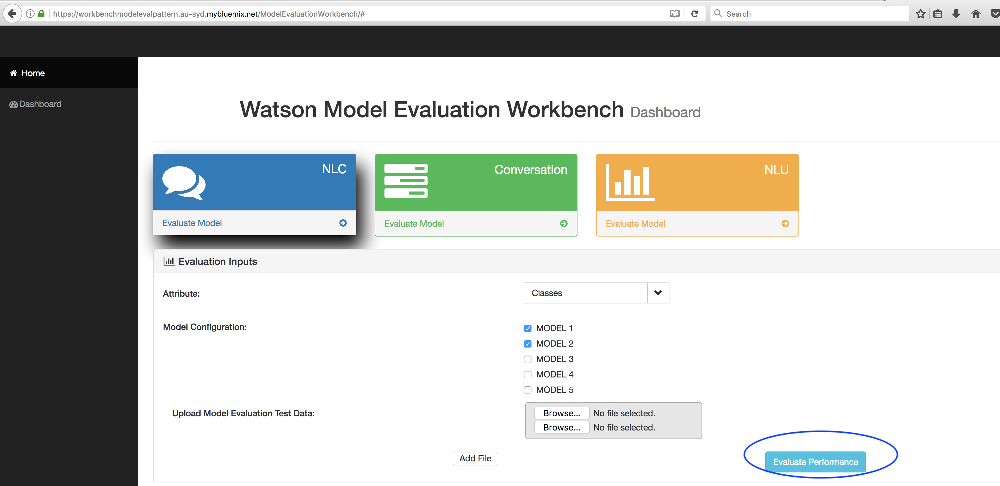


## 5. Analyze the results

Now that we have the results which gives us the comparison between the uploaded models. The model evaluation will recommend for the best model.

See below screenshot, for the best model to be picked based on the score
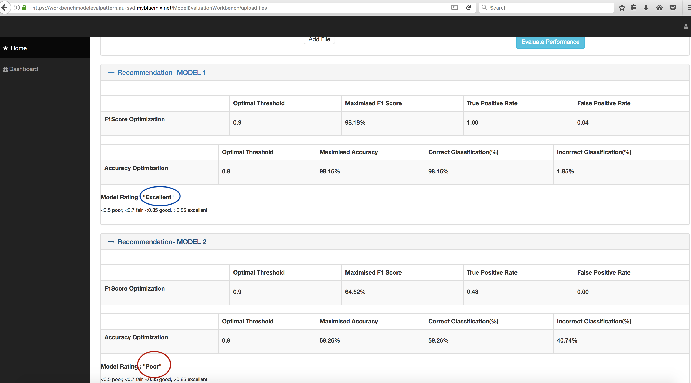

See below screenshot, for the accuraccy
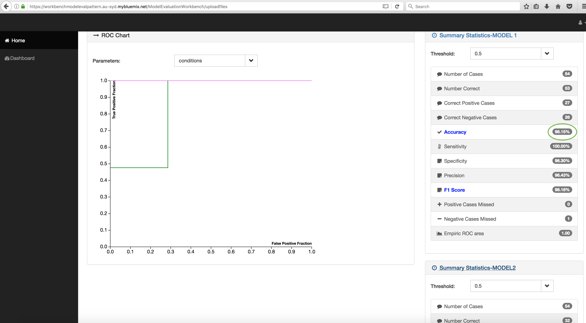

**Results:** In this case, Model Evaluation has recommended “Model 1” as Excellent and “Model 2” as a poor model. We can now pick “Model 1” for our further usage.


## 6. Links
- Ready to learn how to interact with a database? Check out this [Sample and tutorial](https://github.com/IBM-Bluemix/get-started-java) to help you get started with a Java EE app, REST API and a database.

- Liberty App Accelerator: For help generating other Liberty samples checkout the Liberty App Accelerator at [wasdev.net/accelerate](http://wasdev.net/accelerate)

- [Liberty Maven Plug-in]: https://github.com/WASdev/ci.maven

## 7. Learn More
- [Natural Language Classifier](https://console.bluemix.net/catalog/services/natural-language-classifier)
- [Natural Language Understanding](https://console.bluemix.net/catalog/services/natural-language-understanding)
- [Watson Assistant](https://console.bluemix.net/catalog/services/watson-assistant-formerly-conversation)

## 8. License
[Apache 2.0](LICENSE)
