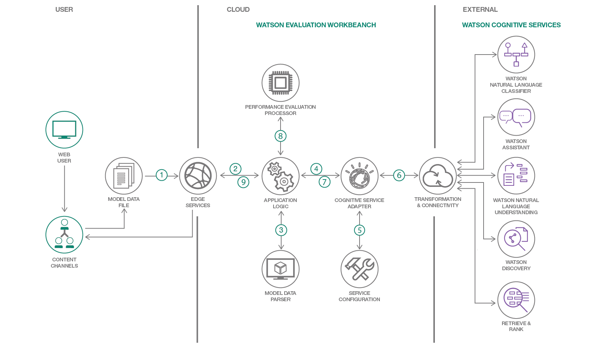

# Cognitive Model Evaluation

Cognitive models are branching out across numerous fields, and to evaluate these models is always a little challenge when you have multiple models in front of you to choose from. This code pattern details about the Watson Model Evaluation Workbench which provides user a platform to configure, execute and test user's cognitive model for tools supported Watson cognitive services, prepare performance evaluation data and calculate performance statistics such as confusion matrix and ROC curve.

By the end of this code pattern reading, one will be able to:
- To compare different Watson cognitive service models and selecting the threshold and best-performing machine learning model.
- Configure Watson cognitive service access details in workbench and input model test data to workbench for service performance evaluation.

Workbench executes supported Watson cognitive services with their input model’s test data, prepare performance evaluation data, calculates performance statistics and present user with the following recommendations, curve and summary statistics:

## Architecture


1. User uses the client device(mobile, tablets, etc.,) to access the application.
2. Client Invokes the URL.
3. Parsing Input test data.
4. Invoke adapter which calls the Cognitive service models(NLC, NLU, etc.,)
5. Parsing the Cognitive(model) service configuration.
6. Connect to Cognitive model services.
7. Gets response from Cognitie services.
8. Compares Input data with cognitive model results and do performance evaluation(ROC Curve, etc.)
9. Performance analysis is shown on UI.
10. User consumes the performance analysis results.

## Included Components
* [Java Liberty Run Time](https://console.bluemix.net/docs/runtimes/liberty/index.html#liberty_runtime)
* [Cognitive Services](https://console.bluemix.net/catalog/)
* [Natural Language Classifier](https://console.bluemix.net/catalog/services/natural-language-classifier)
* [Natural Language Understanding](https://console.bluemix.net/catalog/services/natural-language-understanding)
* [Watson Assistant](https://console.bluemix.net/catalog/services/watson-assistant-formerly-conversation)


## Featured Technologies

* [Liberty for Java](https://console.bluemix.net/docs/runtimes/liberty/index.html#liberty_runtime): Develop, deploy, and scale Java web apps with ease. IBM WebSphere Liberty Profile is a highly composable, ultra-fast, ultra-light profile of IBM WebSphere Application Server designed for the cloud.

## Watch The Video
Will be added soon...


## Steps
Follow these steps to setup and run this code pattern. The steps are described in detail below.
1. [Pre-requisites](#1-pre-requisites)
2. [Deploying Application on IBM Cloud](#2-deploying-application-on-ibm-cloud)
3. [Develop and Configure the models](#3-develop-and-configure-the-models)
4. [Running the application or Model Evaluation](#4-running-the-application-or-model-evaluation)
5. [Analyze the Results](#5-analyze-the-results)


## 1. Pre-requisites
* Clone the GIT repository.
* Have an IBM Cloud account. If NOT, you can create an account [here](https://console.bluemix.net/).

## 2. Deploying Application on IBM Cloud
Three ways to Deploy:
* Deploy using "Deploy to IBM Cloud" Button
* Manual deploy to the local machine
   * Clone the repository
   * Follow the below steps.
* Manually Deploy to IBM CLoud(Bluemix)

##### 2.1 Deploy to IBM Cloud using "Deploy to Cloud" Button.
Click `Deploy to IBM Cloud` button above to deploy the application to IBM Cloud. You would be presented with a toolchain view and asked to "Deploy" the application. Go ahead and click `Deploy` button. The application should get deployed. Ensure that the application is started and that a service is created and bound to the application just deployed.

[](https://bluemix.net/deploy?repository=https://github.com/IBM/model-evaluation-workbench.git)

##### 2.2 Manual deploy to the local machine

- Launch Eclipse tool, under server tab add new Liberty Server.


- Add config parameters to the server.env file within eclipse. Add 2 set of Credentails related to the Cognitive services which you want to evaluate.


- Start the server(Right click on the newly added server)

- Launch the application.


##### 2.3 Manually Deploy to IBM CLoud(Bluemix)


## 3. Develop and Configure the Models:

Develop the Sample Natural Language Classifier model which we will be used for Model Evaluation.

#### 3.1 Create NLC service instance
- Click [here](https://console.bluemix.net/catalog/services/natural-language-classifier) to create NLC service
- Below screen is displayed

- Edit the field "Service name:" to say NLC_Model_Eval and leave the other settings default.
- Click `Create` and then take a note of the credentials as below:
  
-  NLC service instance should get created.

-   Create another Classifier as below screenshot.
-   Upload the available training data if already exists in csv format.


#### 3.2 Model Service Configurations

Administrator needs to configure the supported Watson Service's access/authentication details in Watson Model Evaluation Workbench application.

The Watson Service's access details need to be configured as application's user defined variables in Bluemix console as below,
```
e.g.,
  NLC_USERNAME_CONFIG_1 = <username>
  NLC_PASSWORD_CONFIG_1 = <password>
  NLC_CLASSIFIER_ID_CONFIG_1 = < classifier_id>
```
If User needs to configure multiple Classifier service then CONFIG_2 or CONFIG_3, etc. can be configured as Bluemix user defined variables as below:
```
  NLC_USERNAME_CONFIG_2 = <username>
  NLC_PASSWORD_CONFIG_2 = <password>
  NLC_CLASSIFIER_ID_CONFIG_2 = < classifier_id>
```

Application Dashboard screen provides users an option to select the Watson service configuration (e.g. "CONFIG 1", "CONFIG 2" etc.) to choose their choice of Watson service against which they want to evaluate their ML model.

- Watson Service Configuration


- Watson Model Evaluation Workbench: Dashboard


## 4. Running the application or Model Evaluation

### Use Case:
We created 2 models using Natural Language Classifier.

Now, we would evaluate which model is performing better when compared to each other. For that we would have already configures as per application deployment steps.

Below are the steps to Evaluate the performance:
-	Step1: Ensure the configuration of the credentials in the Runtime Environment variables are set appropriately. See below screen grab.


-	Step2: Launch the app URL


-	Step3: Click on NLC Evaluate model and select the classes from the drop-down bar.


-	Step4: In the model1 and model2 browse for the Truth file (the actual results that you have). This is the file which has the correct sample set of data.


-	Step5: Click on Evaluate Performance button.


## 5. Analyse the results

Now that we have the results which gives us the comparison between the uploaded models. The model evaluation will recommend for the best model.

See below screenshot, for the best model to be picked based on the score


See below screenshot, for the accuraccy


**Results:** In this case, Model Evaluation has recommended “Model 1” as Excellent and “Model 2” as a poor model. We can now pick “Model 1” for our further usage.


## 6. Links
- Ready to learn how to interact with a database? Check out this [Sample and tutorial](https://github.com/IBM-Bluemix/get-started-java) to help you get started with a Java EE app, REST API and a database.

- Liberty App Accelerator: For help generating other Liberty samples checkout the Liberty App Accelerator at [wasdev.net/accelerate](http://wasdev.net/accelerate)

- [Liberty Maven Plug-in]: https://github.com/WASdev/ci.maven

## 7. Learn More
- [Natural Language Classifier](https://console.bluemix.net/catalog/services/natural-language-classifier)
- [Natural Language Understanding](https://console.bluemix.net/catalog/services/natural-language-understanding)
- [Watson Assistant](https://console.bluemix.net/catalog/services/watson-assistant-formerly-conversation)

## 8. License
[Apache 2.0](LICENSE)
